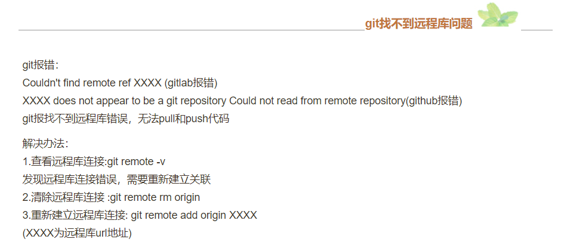
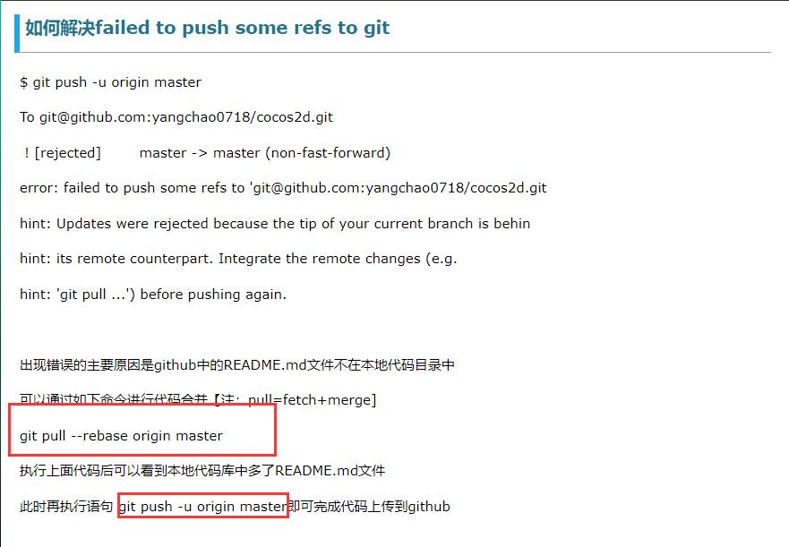
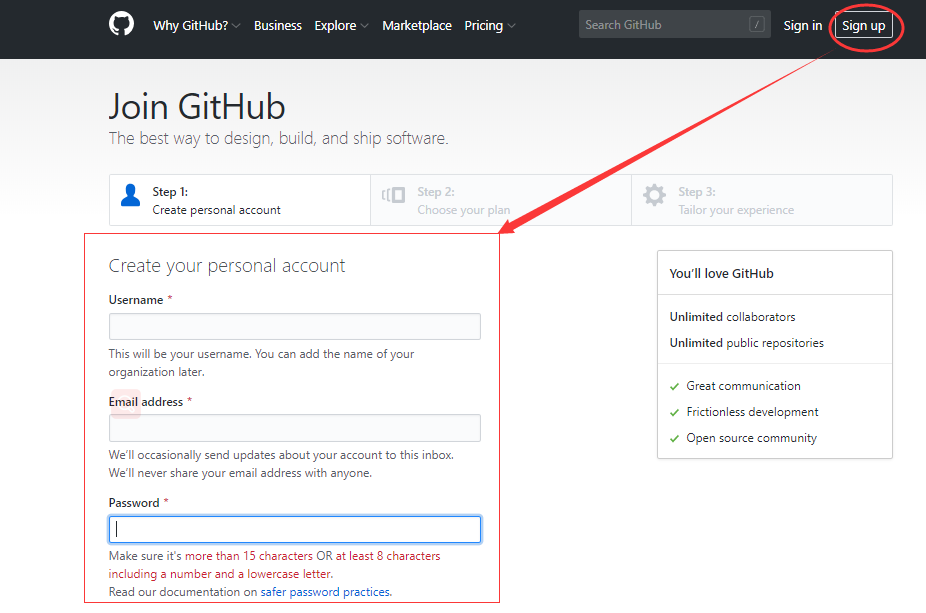
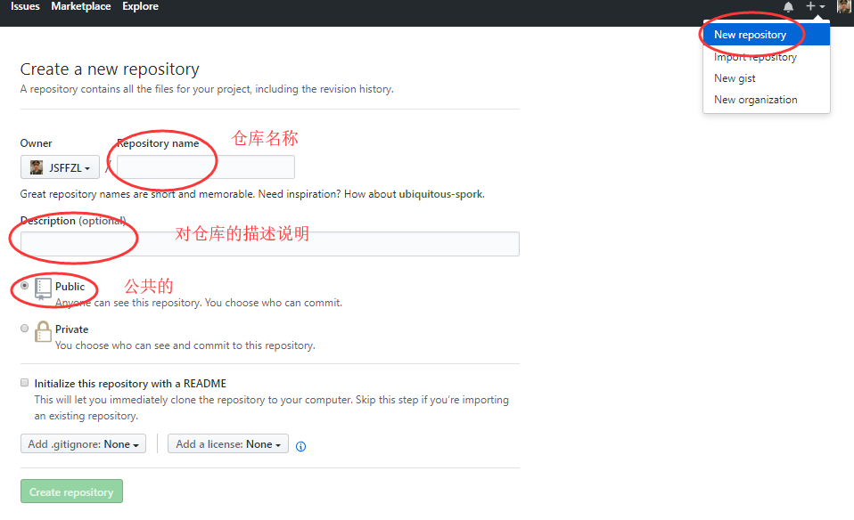
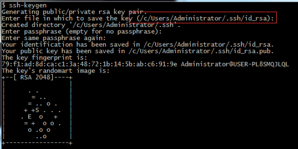
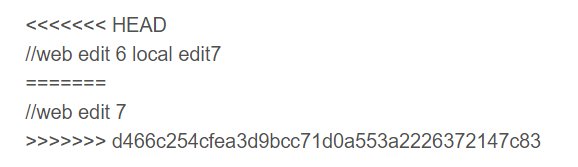

### git的介绍
[Windows安装参考链接](https://segmentfault.com/a/1190000011809698)
#### 全局配置用户信息：
1. git config --global user.name  xxx(用户名)
2. git config --global user.email  xxxx(邮箱地址)
3. git config --list   查看全局的配置
 
> git是一个开源的分布式版本控制系统，快速，高效地处理从小型到大型项目的所有事物管理。
> 结束了手动管理多个“版本”的史前时代





### git和svn的区别:
1. git是分布式的，svn是集中式的。(最核心);
2. git是每个历史版本都存储完整的文件，便于恢复;
3. svn是存储差异文件，历史版本不可恢复(核心);
4. git可离线完成大部分操作，svn则不能。(最核心);
5. 自动记录每次的修改，并且可以方便的切换到任一版本;
6. 强大的分支管理可以完成多人协作开发。

##### git中的名字
stage暂存区  
master分支  
.git版本库/仓库 
.git目录之外都市属于工作区
### git基本操作
|命令  |  说明 |
---|---
|git config --list  |  获取git 的配置项
|git config 配置项名  |  获取具体的配置名
|git config  --global 配置项名 新名字  |  修改配置项
|git init  |  初始化本地版本库
|git status  |  查看仓库状态
|git add .  |  把工作区的所有修改提交到暂存区
|git add 文件路径  |  把工作区指定文件提交到暂存区
|git commit -m "描述"  |  把暂存区的修改提交本地版本库（master分支）
|git diff  |  查看工作区具体修改
|git diff --cached  |  查看暂存区具体修改
|git log  |  查看历史记录 （在英文状态下Q退出当前状态）
|git reflog  |  可以查看所有分支的所有操作记录（包括已经被删除的 commit 记录和 reset 的操作）
|git pull origin master  |  远程代码拉取到本地工作区
|git commit -am "描述"  |  提交工作区自上次commit之后的变化，直接到仓库区（省略git add）
|git checkout .  |  撤回所有文件
|git checkout 文件夹名  |  撤回该文件夹
|git checkout 路径/文件名  |  工作区撤回该文件/撤销工作区的修改
|git reset 路径/文件名  |  把暂存区的文件撤回到工作区
|git reset --hard HEAD^  |  回退到上个版本
|git branch 名字  |  新建分支
|git checkout 分支名  |  切换分支
|git checkout -b 分支名  |  切换并新建分支
#### 撤销
1. 第一种情况：撤销工作区的修改
git checkout 文件路径 
2. 第二种情况：撤销暂存区的修改
i. git reset 文件路径 （把暂存区的修改撤回工作区）
ii. git checkout 文件路径 
3. 第三种情况：版本回退
git reset --hard HEAD^   //回退到上个版本
git reset --hard HEAD^^  //上上个版本
HEAD^^^~n           //回退到n个版本上

```
回退到指定版本（回到现在过去）
git reset --hard commit_id(e66aa88...)
```

> **如何获取所有版本的commit_id呢？**
> 针对这个需求，需要分两种情况：
> *	第一，git bash窗口没有关闭，使用前面查过的commit_id
> *	第二，git bash窗口关闭。比如，昨天做的操作，今天后悔了。 使用 git reflog。

> ##### 命令窗口退出（英文状态下）
> :wq 强制退出当前
> q 退出git log 描述

#### github 远程仓库
[gitHub是一个网站](https://github.com/)，开源及私有软件项目的托管平台，因为只支持git 作为唯一的版本库格式进行代码托管，故名gitHub。

托管有这么几层含义：
将自己平时写的项目保存到GitHub上。
可以作为Git服务器来使用。

**温故：**
Git是一个版本控制系统，是一个工具。提供了诸多的一些命令，从而完成版本的控制以及协作开发。

注册账号 -----> 创建版本库




github支持两种加密传输协议：ssh   https
ssh协议提交代码时需要配置公钥和秘钥



https协议提交代码时需要用户名和密码

#### 添加远程仓库
> git remote add origin 仓库的地址     添加远程仓库地址
> git remote –v    查看关联的远程仓库
#### 本地项目推送远程仓库
> git init  （初始化本地仓库）
> git add .  （工作区提交暂存区）
> git commit -m “描述” （提交仓库）
> git remote add origin github仓库的地址  （远程仓库地址）
> git remote -v  （查看关联的远程仓库）
> git push origin master  （推送到远程仓库）
**注：远程仓库和本地文件必须一致否则推送失败**
#### 克隆远程仓库
> git clone  仓库的地址 
> git pull origin master  --allow-unrelated-histories 远程代码拉取到本地工作区（自动合并） 
> git push -u origin master   提交到远程仓库
#### 远程仓库克隆到本地
> git clone  仓库的地址
> git add .
> git commit -m “描述”
> git pull origin master --allow-unrelated-histories  远程代码拉取到本地工作区
> git push -u origin master  提交到远程仓库
### 分支管理
> **为什么使用分支？**
> 可以创建一个属于自己的分支，别人看不见，在自己的分支上进行开发，等开发完毕，还继续在原来的分支上合并。

#### 分支的基本操作
> 创建分支 （git branch 分支名）
> 查看当前分支 （git branch）
> 切换分支（git checkout 分支名）
> 分支的合并 （git merge 分支名）
> 分支的删除（git branch -d 分支名）

> git branch -r  查看远程所有分支
> git branch -a   查看本地和远程所有分支
> git checkout -b 分支名  创建并切换到该分支
> git branch -d 分支名  删除本地分支
> git push origin -d 分支名  删除远程分支

> **如何解决代码冲突？**
1.冲突的代码

> 手动解决冲突文件，再次commit，然后push

### git中一些选项解释
> -d  --delete：删除 
 -D  --delete --force的快捷键 
-f  --force：强制 
-m  --move：移动或重命名 
-M  --move --force的快捷键 
-r  --remote：远程 
-a  --all：所有

|命令  |  说明  |
--- | ---
|pwd  |  查看工作目录
|cd [目录位置]  |  切换工作目录
|ls [选项]…[目录或文件名]  |  显示某一个文件，或者某一个目录旗下子目录的属性。
|du [选项]… [目录或文件名]  |统计目录及文件的空间占用情况